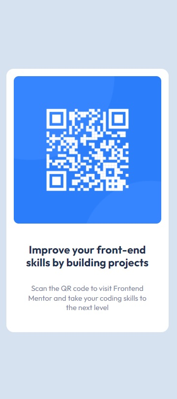

- Overview:
  - [QR code component](#the-challenge)
  - [https://wella4life.github.io/Challenge_10_Easy/](#links)
  - 
  - 

 - Users should be able to:
   - View the optimal layout for the site depending on their device's screen size

 - What I Learned:
   - I can do Easy projects in about 30 mins to 1 hour easily
